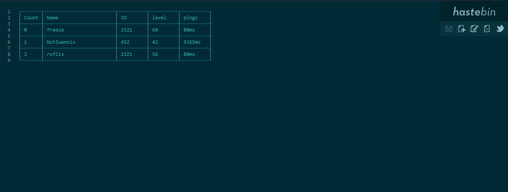

<h1 align="center">Welcome to better-hastebin 👋</h1>
<p align="center">
  
  <a href="https://www.npmjs.com/package/better-hastebin">
    
  </a>
  <a href="https://github.com/freezegr/insta.js/blob/master/LICENSE">
    
  </a>
  <a href="https://discord.gg/pQdhaUBFcc">
    
  </a>
</p>

---

- [Installation](#Installation)
    - [Upload](#Upload)
    - [option.raw](#option.raw)
    - [option.server](#option.server)
- [Table](#Table)
- [Support](https://discord.gg/pQdhaUBFcc)

## Installation 

`npm i better-hastebin`

## Upload

```js
const hastebin = require('better-hastebin');

hastebin('hello world').then((url) => {
  console.log(url) //-> https://hastebin.de/owixegarak
});
```

## option.raw

```js
const hastebin = require('better-hastebin');

let options = {
  raw: true
};

hastebin('hello world', options).then((url) => {
  console.log(url) //-> https://hastebin.de/raw/owixegarak
});
```

## option.server

```js
const hastebin = require('better-hastebin');

let options = {
  server: 'https://hastebin.com/'
};

hastebin('hello world', options).then((url) => {
  console.log(url) //-> https://hastebin.com/owixegarak
});
```

## Table

[Cli-table](https://www.npmjs.com/package/cli-table) is a table maker npm.

```js
const Table = require(`cli-table`);
const hastebin = require('better-hastebin');

let table = new Table({
  head: [
    `Count`,
    `Name`,
    `ID`,
    `level`,
    `pings`
  ], colWidths: [7, 25, 10, 10, 10]
});

let players = [
  {
    name: 'freeze',
    id: 2321,
    pings: 80,
    level: 60
  },
  {
    name: 'NotIwannis',
    id: 452,
    pings: 9265,
    level: 42
  },
  {
    name: 'roflis',
    id: 5361,
    pings: 89,
    level: 56
  }
];

players.forEach((player, count) => table.push([count, player.name, player.id, player.level, player.pings+'ms']));

hastebin(table.toString()).then((url) => {
  console.log(url)
});
```
